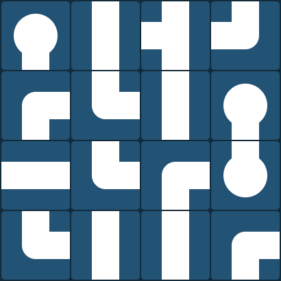
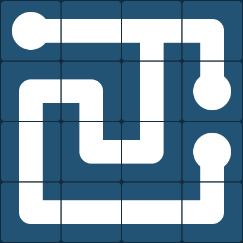

# lowderdev github page

Right now I'm using this to host a little game I made for fun in [Elm](https://elm-lang.org).
Visit [lowderdev.github.io](https://lowderdev.github.io/) to play!

## How to play

- When the games starts you will see a board of scrambled tiles
- Clicking a tile will rotate it 90 degrees clockwise
- rotate the tiles until you form a single connected network with no loops





## Local Setup

Install, `elm`, `elm-live`, and then run `elm-live`

```shell
npm install -g elm elm-live
elm-live src/Main.elm -- --output=main.js
```

Then visit [http://localhost:8000](http://localhost:8000)

## TODO

- Refactor code and add tests if I stop being lazy
- More engaging/fun solved state
- Timer? Score?
- Hard mode with time limit and/or game over if you over rotate a tile
- Hexagon version? 
- Different maze-gen algorithms?
